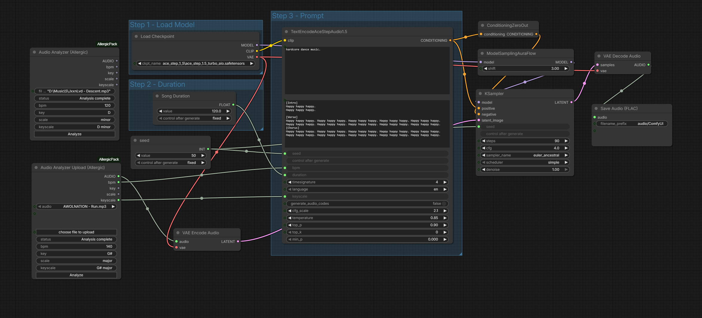
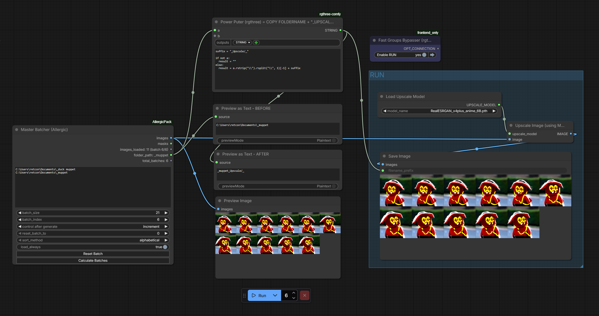
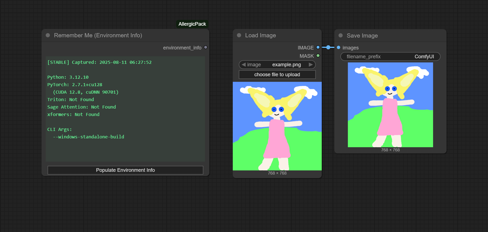
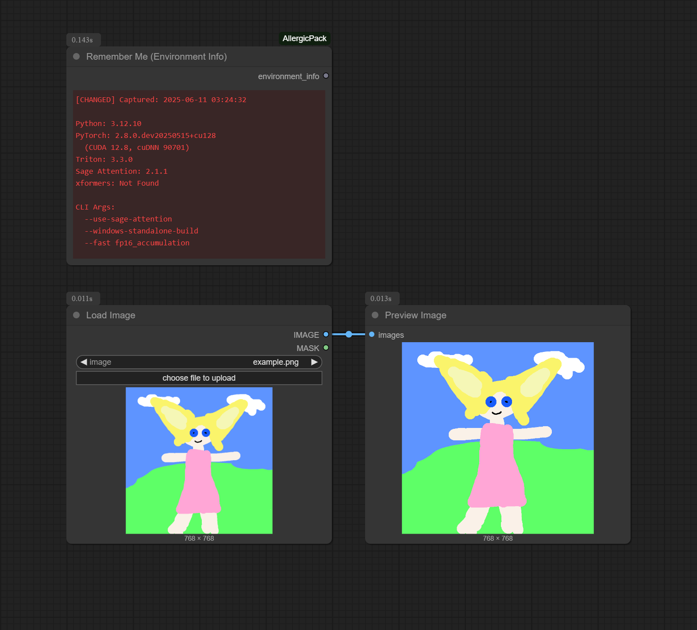
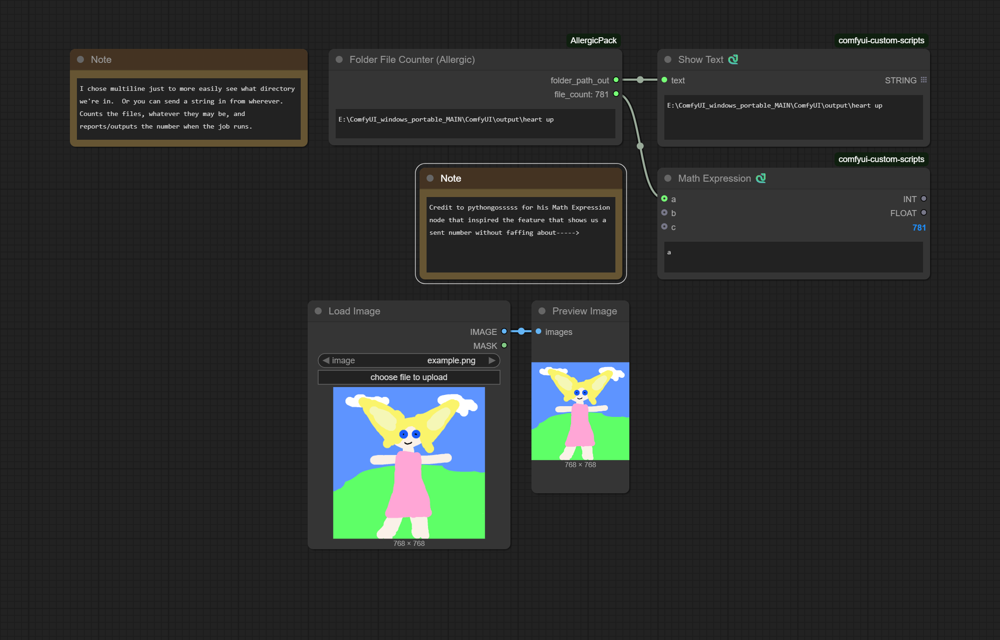

## ComfyUI-AllergicPack
Every once in a while I want a new node.  If I'm using it then I'm putting it here.  Good luck.

## Installation
Clone to "custom_nodes"

```
git clone https://github.com/usrname0/ComfyUI-AllergicPack.git
```

### Dependencies
Dependencies should install automatically via `pyproject.toml` if you're using the Comfy Manager or Registry. If not, you can install them manually from ComfyUI\custom_nodes\AllergicPack:

```
..\..\..\python_embeded\python.exe -m pip install .
```

## Audio Analyzer
Detects BPM and musical key from an audio file using the Krumhansl-Schmuckler algorithm. Outputs BPM (INT), key, scale, and keyscale (e.g. "G minor") as well as an AUDIO output. Comes in two variants:
- **Audio Analyzer** - accepts a raw file path string (for minimalists)
- **Audio Analyzer Upload** - uses ComfyUI's built-in file picker with audio preview



## Master Batcher
Batched image loader that processes multiple folders sequentially. Accepts a multi-line list of folder paths and auto-increments through all of them batch by batch, outputting the correct folder path with each batch. Includes sorting options (alphabetical, by date, random) and a reset button.



## Remember Me (Environment Info)
Captures Python environment info (PyTorch, CUDA, Triton, Sage Attention, xformers, CLI args) and saves it into the node and your output metadata. Useful for tracking down why saved workflows produce different results on different setups or after package updates.

Features:
- **Populate button** - Click "Populate Environment Info" to collect data immediately without running the workflow. Recommended on first load so your first queue already contains metadata.
- **Change detection** - After each run the node compares the current environment against the previous snapshot. A dedicated diff window shows exactly what changed, highlighted in red for changes or green for stable.
- **Persistent comparison** - The previous snapshot is saved with the workflow, so change detection works across sessions.




## Incrementor Plus
An incrementor with a reset button and adjustable step size.

(Note: The value on the node itself shows the NEXT value.  This is normal.)


## Folder File Counter
Indiscriminately counts files in a folder and displays it on the node itself (by INT out).


