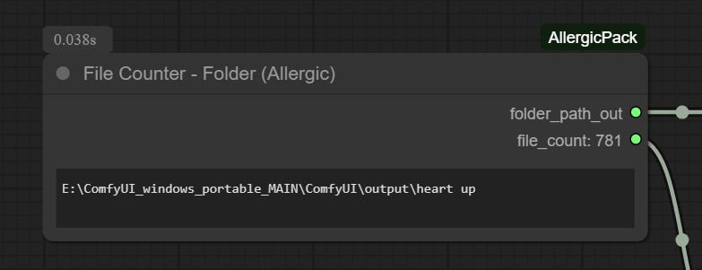

## ComfyUI-AllergicPack
This package is not ready for primetime but I'm making it public anyway.  If I'm using the node then I'm putting it here.  Might make it more official later.  Use at your own risk.

## FileCounter-Folder
Indiscriminately counts files in a folder quickly and displays it on the node itself (by INT out).
