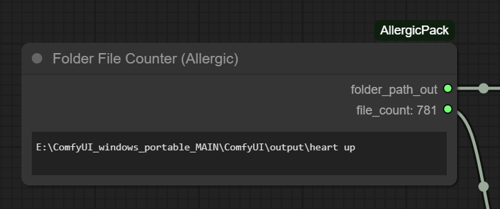
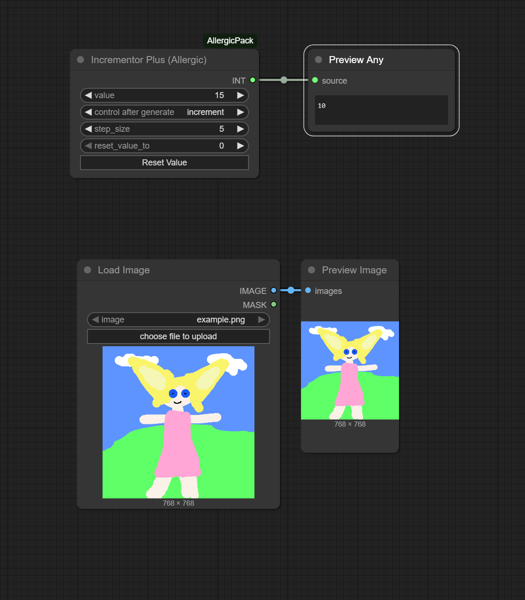

## ComfyUI-AllergicPack
This package is not ready for primetime but I'm making it public anyway.  If I'm using the node then I'm putting it here.  Might make it more official later.  Use at your own risk.

## Installation
Clone to "custom_nodes"

```
git clone https://github.com/usrname0/ComfyUI-AllergicPack.git
```

## Folder File Counter
Indiscriminately counts files in a folder and displays it on the node itself (by INT out).


## Incrementor Plus
An incrementor with a reset button and adjustable step size.


