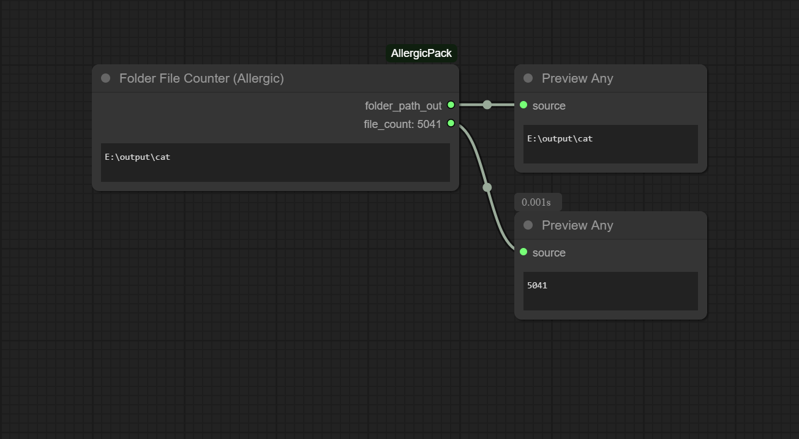
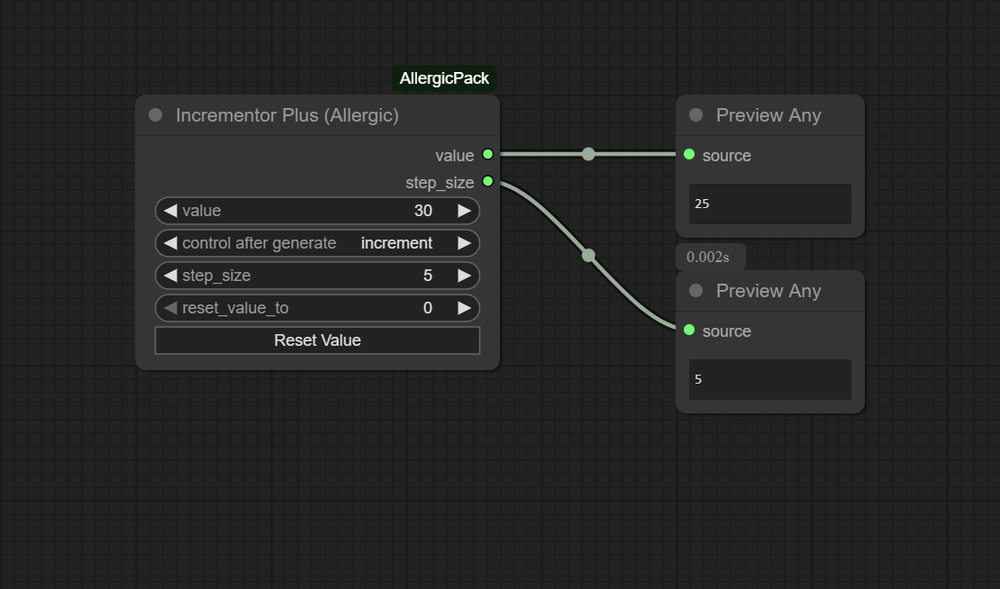
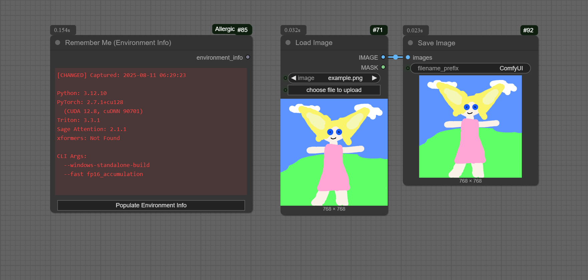

## ComfyUI-AllergicPack
This package is somewhat ready for primetime.  If I'm using the node then I'm putting it here.  Good luck.

## Installation
Clone to "custom_nodes"

```
git clone https://github.com/usrname0/ComfyUI-AllergicPack.git
```

## Folder File Counter
Indiscriminately counts files in a folder and displays it on the node itself (by INT out).


## Incrementor Plus
An incrementor with a reset button and adjustable step size. 

(Note: The value on the node itself shows the NEXT value.  This is normal.)


## Remember Me (Environment Info)
This node will save some environment info into itself and therefore into your output metadata.  It also turns green/red after subsequent runs to alert you to changes in environment info .  This can be handy if you're wondering why your image/video metadata isn't giving you the expected results. 
 
It will always update itself with the latest run so if you have a mismatch you'll have to reload your source file to see what changed.  (I tried a more complicated comparison logic but it wasn't worth it)

Note: When you first load the node into a new workflow you'll have to hit "Populate Environment Info" if you want your first run to actually conatain metadata.  Otherwise first run populates data into the node and subsequent runs store data and compare.  This is just a quirk of how it works until I think of something more clever.



